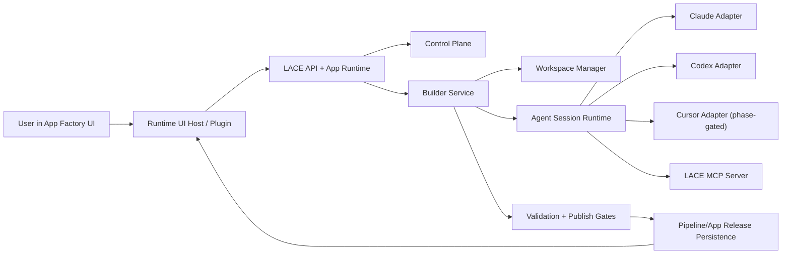

# App Factory Builder Plane Master Plan

Status: Proposed  
Date: 2026-03-06  
Owner: Platform + Agent Runtime + Control Plane + Frontend  
Scope: Enterprise implementation plan for App Factory, Builder Plane, coding-agent control, and a Codex-desktop-style runtime UI inside LACE

---

## 1. Purpose

This document is the canonical persisted plan for the new full agentic capability in LACE.

The goal is not a demo-only workspace agent. The goal is a production-grade Builder Plane that lets a user describe a new app in the LACE web UI, then have LACE:

- plan the target app contract,
- launch a real coding-agent-backed builder session in an isolated workspace,
- generate pipeline YAML, runtime UI, tests, release bindings, and supporting code,
- run checks and repair failures,
- keep the user in the loop for clarifications, steering, and approvals,
- publish the resulting app through the existing LACE app/release architecture.

This plan treats the frontend as first-class. The App Factory UX target is a Codex Desktop style experience: streaming chat, live tool/command activity, approvals, diffs, test results, and publish controls in a rich runtime shell.

---

## 2. Authoritative Inputs

Primary repo authorities for this effort:

- `docs/ARCHITECTURE.md`
- `docs/spec/CONTROL_PLANE_REFACTOR_PLAN.md`
- `docs/spec/DEMO_PREP_MASTER_LIST.md`
- `AGENTS.md`

Existing repo seams that this plan must extend instead of bypass:

- `src/lace/agent_runtime/contracts.py`
  - current agent runtime is one-shot task oriented, not session oriented.
- `src/lace/agent_runtime/worker.py`
  - adapter registry exists, but default runtime is still `generic_harness`.
- `src/lace/agent_runtime/adapters/claude_code_cli.py`
  - stub only.
- `src/lace/agent_runtime/adapters/codex_cli.py`
  - stub only.
- `frontend/src/pages/AppRuntimePage.tsx`
  - app runtime shell, run/session/event plumbing already exists and should be reused.
- `frontend/src/runtime-ui/sdk.ts`
  - runtime plugin SDK exists and is the correct extension boundary for App Factory UI modules.
- `docs/spec/workspace-agent/CODING AGENT PROMPT-workspace-agents.md`
  - useful reference for workspace isolation and approvals, but insufficient for the full Builder Plane and should be treated as reference-only for this track.

---

## 3. Non-Negotiable Invariants

- Artifact IR remains the source of truth for generated artifacts.
- `DeterministicApply` remains the only valid IR mutation path in generation flows.
- Tool-calling and coding-agent steps emit structured outputs and traces; they do not silently mutate LACE runtime state.
- Coding agents may write repo files only inside a controlled workspace/worktree/container.
- Pipelines, apps, releases, and publish actions must flow through LACE services and persistence layers.
- `steps[].type` and `steps[].type_id` remain step type identifiers only.
- `lace.SubPipeline.v1` remains deterministic expansion, not dynamic runtime branching magic.
- App runtime is plan-first by default.
- Every app-initiated run must persist `app_id`, `session_id`, and `release_id`.
- The Postgres-backed path is the primary supported enterprise path.
- The App Factory must be implemented as a published LACE app, not as a special-case sidecar page.
- The frontend target is not a thin harness. It must provide a serious operator-grade builder experience.

---

## 4. Product Definition

### 4.1 Primary Product

Create a first-class LACE app named `App Factory`.

User story:

1. User opens App Factory.
2. User describes a business use case in plain language.
3. LACE converts the request into a strict builder contract.
4. LACE opens a builder session and starts one or more coding-agent implementation runs.
5. The builder agent creates and repairs the app until checks pass or it is blocked.
6. The user can answer questions, steer the run, approve sensitive actions, inspect diffs, and publish.
7. The generated app becomes a normal LACE published app available through the canonical runtime entry flow.

### 4.2 Golden Path Proof

The first serious proof target is a municipal permitting research app with:

- a refresh/ingest pipeline for municipal and state sources,
- an answer pipeline for end-user requests,
- a runtime UI plugin,
- tests and fixtures,
- app release bindings,
- policy and provenance enforcement.

---

## 5. Architectural Decision

Decision: build a new Builder Plane on top of the existing Published Apps, Control Plane, Pipeline Runtime, and Agent Runtime architecture.

Do not:

- automate vendor GUIs,
- make the coding agent the system of record,
- add hidden mutation paths,
- build a parallel app runtime stack.

Do:

- normalize vendor-native agent runtimes behind LACE,
- attach them to isolated workspaces,
- stream their state into LACE runtime UI,
- publish through the existing release model.

---

## 6. Target Architecture



### 6.1 New Builder Plane Components

#### A. AppDefinitionIR

A new strict, versioned build contract produced before any coding-agent file edits.

Minimum required fields:

- app metadata: slug, title, description, owner, lifecycle metadata
- use case summary
- user input schema
- output schema
- runtime intents and primary screens
- pipeline plan
- data source and retrieval plan
- control-plane policy envelope
- test plan
- acceptance criteria
- publish criteria
- planner trace references

This is the canonical build spec for generated apps.

#### B. Builder Service Layer

New backend services under `src/lace/builder/*` should:

- create and persist builder sessions,
- manage builder state transitions,
- create isolated workspaces,
- invoke coding-agent adapters,
- track changed files and command/test execution,
- manage publish gates,
- record audit events,
- attach planner trace and build trace.

#### C. Session-Oriented Agent Runtime

Extend `src/lace/agent_runtime/*` from one-shot task execution to a real session subsystem with:

- `start()`
- `send()`
- `steer()`
- `approve()`
- `interrupt()`
- `stream()`
- `close()`

Normalized event types:

- `assistant.delta`
- `assistant.message`
- `tool.started`
- `tool.finished`
- `approval.requested`
- `approval.resolved`
- `question.requested`
- `question.answered`
- `file.patch`
- `command.started`
- `command.finished`
- `test.result`
- `status`
- `error`
- `done`

#### D. LACE MCP Server

Expose platform-native tools to all coding agents through one typed surface.

Minimum tool set:

- `lace.get_architecture_context`
- `lace.list_step_catalog`
- `lace.create_pipeline_draft`
- `lace.validate_pipeline_draft`
- `lace.publish_pipeline_version`
- `lace.create_app_draft`
- `lace.create_app_release`
- `lace.create_runtime_ui_plugin_stub`
- `lace.run_repo_checks`
- `lace.run_frontend_checks`
- `lace.request_human_review`
- `lace.get_control_plane_policy`
- `lace.get_ui_runtime_contract`

This keeps agents off brittle raw shell/API flows and gives LACE one audit and policy boundary.

#### E. Workspace Isolation Layer

Every builder run gets an isolated worktree/container with:

- allowlisted writable roots,
- read-only architecture/spec context mounts,
- scoped env injection,
- outbound network policy,
- vendor guidance files where appropriate:
  - `AGENTS.md`
  - `.claude/settings.json`
  - `.cursor/rules/*`
- full audit logging for prompts, approvals, commands, diffs, tests, and publish actions.

#### F. Publish Gate

Builder runs may propose code and artifacts. They may not directly publish. Publication must remain a governed LACE service action after:

- validation,
- tests,
- policy checks,
- human review when required,
- release persistence.

---

## 7. Vendor Strategy

### 7.1 Day-One Priority

Ship these in this order:

1. `CodexAppServerAdapter`
2. `ClaudeAgentSdkAdapter`
3. `CodexExecAdapter`
4. `ClaudeCodeCliAdapter`
5. `CursorCliAdapter`
6. `CursorAcpAdapter` after the event/approval contract is stable

### 7.2 Why

- Codex app-server is the best fit for a rich embedded client.
- Claude Agent SDK is the cleanest backend integration surface with approvals and user input.
- CLI modes remain useful for repair loops, CI-style tasks, and fallback execution.
- Cursor is valuable, but its headless mode is powerful enough that isolation work must land first.

### 7.3 Rule

Do not script vendor UIs. Use documented native runtime surfaces only.

---

## 8. Codex Desktop Style UI Target

This UI is in scope for the Builder Plane. It is not a cosmetic afterthought.

### 8.1 UX Goal

The App Factory runtime should feel like a serious desktop coding-agent client inside the browser:

- full chat thread,
- streaming assistant output,
- live command/tool timeline,
- approval prompts,
- clarifying question loop,
- file diff and changed-files browser,
- test results and repair loop visibility,
- publish controls and release summary,
- durable session history.

### 8.2 Required App Factory Surfaces

Implement runtime plugin entrypoints under `frontend/src/runtime-ui/plugins/app-factory/`:

- `new_run`
- `session_home`
- `run_detail`

### 8.3 Required Panels

The `run_detail` experience should include:

- conversation pane,
- activity/timeline pane,
- workspace changes pane,
- tests/checks pane,
- approval queue,
- publish/release pane.

### 8.4 UI Architecture Rules

- Reuse the existing runtime host and plugin loader.
- Stream via the real event APIs, not polling-only fallbacks on the golden path.
- Persist view state through session UI state APIs.
- Keep App Factory within the same route and release resolution model as other LACE apps.
- Prefer a desktop-grade split-pane layout and explicit status cards over raw JSON dumps.

### 8.5 Phase Split Inside the UI Workstream

#### UI-A: Required for first enterprise release

- streaming chat,
- event timeline,
- approvals,
- clarifying questions,
- diff summary,
- test summary,
- publish workflow,
- builder session history.

#### UI-B: Immediate hardening after first full cut if time forces sequencing

- workspace tree navigation,
- richer patch viewer,
- multi-agent lane visualization,
- resumable panel layouts,
- command log search/filter,
- worktree snapshot compare.

UI-B is hardening, not re-architecture. The layout and state model in UI-A must already support it.

---

## 9. Data Model and Persistence Additions

Postgres is the primary supported path. File backend support may exist where practical, but must not define the architecture.

### 9.1 New Canonical Objects

- `AppDefinitionIR`
- `BuilderSession`
- `BuilderMessage`
- `BuilderRun`
- `AgentSession`
- `AgentApproval`
- `BuilderArtifactChange`
- `BuilderPublishDecision`

### 9.2 Persistence Expectations

Add migrations and full-schema updates for:

- builder session state,
- builder audit/events,
- agent session handles and vendor correlation ids,
- approval records,
- changed-file manifests,
- publish actions and release linkage,
- planner trace linkage for builder planning.

### 9.3 Identity Rules

Every builder flow must preserve:

- `app_id`
- `session_id`
- `release_id`
- `run_id`
- `builder_session_id`
- `agent_session_id`
- vendor session/thread identifiers where applicable

---

## 10. Control Plane Dependencies

The Builder Plane depends on target-state control-plane behavior from `docs/spec/CONTROL_PLANE_REFACTOR_PLAN.md`.

Minimum required control-plane items before the golden path is considered done:

- CP-0.1 control-plane v3 semantics in contracts
- CP-0.2 recommendation and alert filtering cleanup
- CP-0.3 app run context identity
- CP-1.1 planner engine insertion with deterministic baseline, strict schema parse, clamp, and deterministic fallback
- CP-1.2 planner trace persistence
- CP-3.1 app runtime plan-first default path

The builder planner must follow the same discipline:

- deterministic baseline,
- optional LLM proposal,
- strict schema validation,
- clamp and policy revalidation,
- deterministic fallback.

---

## 11. Execution Plan

### Phase 0. Baseline Hardening

Deliver:

- app-scoped run identity persistence,
- plan-first app runtime default path,
- real supported streaming path on Postgres,
- elimination of golden-path `501` or stubbed primary UX surfaces,
- action contract cleanup per control-plane plan.

Exit criteria:

- normal app runs are planner-mediated by default,
- run identity is durable,
- App Factory can rely on real streaming and supervision plumbing.

### Phase 1. Agent Runtime Substrate

Deliver:

- normalized session contract,
- adapter registry refactor,
- event normalization,
- approval/question plumbing,
- interrupt/resume/close lifecycle,
- vendor session persistence.

Exit criteria:

- at least one adapter can sustain multi-turn streaming with approvals and resume.

### Phase 2. Real Vendor Adapters

Deliver:

- `CodexAppServerAdapter`
- `ClaudeAgentSdkAdapter`
- `CodexExecAdapter`
- `ClaudeCodeCliAdapter`
- optional `CursorCliAdapter` if it meets isolation and timeline requirements this week

Exit criteria:

- Codex and Claude both work end to end in controlled workspaces,
- no UI-exposed adapter is fake.

### Phase 3. LACE MCP Server

Deliver:

- MCP server runtime,
- tool registration,
- audit integration,
- policy gating for tool access,
- adapter integration so agents can use MCP during builder runs.

Exit criteria:

- builder agent can create, validate, test, and publish through LACE-native tools rather than ad hoc shelling.

### Phase 4. Builder Domain and Services

Deliver:

- `AppDefinitionIR`,
- builder planner,
- builder session service,
- workspace manager,
- publisher/gating service,
- session persistence,
- audit model.

Exit criteria:

- a builder session can be created, resumed, and traced independently of a single one-shot task.

### Phase 5. App Factory Product

Deliver:

- `lace.AppFactoryPipeline`,
- app definition and release binding,
- runtime UI plugins,
- builder chat/session history,
- approvals and clarifications,
- publish flow,
- release summary.

Exit criteria:

- App Factory is a real published app resolved through the standard route model.

### Phase 6. Municipal Permitting Golden Path

Deliver:

- generated ingest/refresh pipeline,
- generated answer pipeline,
- generated runtime UI plugin,
- tests and fixtures,
- release bindings,
- policy defaults for source trust and provenance.

Exit criteria:

- App Factory can generate and publish the municipal permitting app end to end.

### Phase 7. Hardening and Ops

Deliver:

- audit surfaces,
- observability and metrics,
- workspace cleanup and retention policy,
- failure recovery and resume,
- access control review,
- documentation and operator runbooks.

Exit criteria:

- system is supportable, debuggable, and safe enough for enterprise rollout.

---

## 12. File-by-File Execution Map

### Backend

- `src/lace/control_plane/contracts.py`
- `src/lace/control_plane/service.py`
- `src/lace/control_plane/router.py`
- `src/lace/control_plane/executor.py`
- `src/lace/agent_runtime/contracts.py`
- `src/lace/agent_runtime/worker.py`
- `src/lace/agent_runtime/event_stream.py`
- `src/lace/agent_runtime/workspace.py`
- `src/lace/agent_runtime/adapters/base.py`
- `src/lace/agent_runtime/adapters/claude_code_cli.py`
- `src/lace/agent_runtime/adapters/codex_cli.py`
- new `src/lace/agent_runtime/adapters/codex_app_server.py`
- new `src/lace/agent_runtime/adapters/claude_agent_sdk.py`
- new `src/lace/agent_runtime/adapters/cursor_cli.py`
- new `src/lace/builder/contracts.py`
- new `src/lace/builder/models.py`
- new `src/lace/builder/service.py`
- new `src/lace/builder/session_store.py`
- new `src/lace/builder/workspace.py`
- new `src/lace/builder/publisher.py`
- new `src/lace/mcp/server.py`
- new `src/lace/mcp/tools/*`
- `src/lace/api/models.py`
- `src/lace/api/server.py`
- `src/lace/api/store.py`
- `src/lace/api/postgres_store.py`
- `src/lace/api/mvp_store.py`
- `src/lace/domain/steps/bootstrap.py`
- `src/lace/domain/steps/tool_agent.py`

### Frontend

- `frontend/src/lib/api.ts`
- `frontend/src/pages/AppRuntimeHostPage.tsx`
- `frontend/src/pages/RuntimeUiIframePage.tsx`
- `frontend/src/runtime-ui/sdk.ts`
- `frontend/src/runtime-ui/events.ts`
- new `frontend/src/runtime-ui/plugins/app-factory/*`
- `frontend/src/components/control/*`

### Pipelines

- new `pipelines/lace.AppFactoryPipeline.yaml`
- new `pipelines/lace.BuilderValidationPipeline.yaml`
- generated-app golden path fixtures under `pipelines/tenant.*` or equivalent tenant-scoped naming

### Persistence

- `migrations/sql/full_schema.sql`
- new migration files for builder and agent session persistence

### Tests

- `tests/unit/builder/*`
- `tests/unit/agent_runtime/*`
- `tests/unit/control_plane/*`
- `tests/integration/builder/*`
- `frontend/src/**/*.test.tsx`
- `frontend/e2e/app-factory.spec.ts`

---

## 13. Acceptance Bar

This effort is not done until all of the following are true:

- A user can describe a new app inside App Factory.
- LACE produces a validated `AppDefinitionIR`.
- LACE launches a real coding-agent-backed builder session.
- The builder session streams meaningful progress continuously.
- The user can answer clarifying questions and steer the session.
- Sensitive actions can be approved or denied.
- The agent writes real repo files only in an isolated workspace.
- Validation and tests run automatically.
- Repair loops are visible and bounded.
- Publish creates a real pipeline version and app release.
- The generated app is reachable through the canonical route resolver.
- Audit data exists for prompts, approvals, commands, diffs, tests, and publish actions.
- The supported Postgres path has no golden-path `501` or stub behavior.
- The App Factory UI is credible as a serious operator product, not a raw JSON harness.

---

## 14. Verification Expectations

Run after each meaningful code change:

1. `bash scripts/test_per_change.sh`
2. If persistence/database paths changed: `bash scripts/test_integration_groups.sh persistence_postgres`

Run targeted suites for touched areas:

1. `python3 -m unittest discover -s tests/unit -p "test_*.py" -v`
2. `cd frontend && npm run typecheck`
3. `cd frontend && npm run lint`
4. `cd frontend && npm run test:ui`

Run before handoff:

1. `bash scripts/test_precommit_full.sh`
2. `python3 scripts/check_mvp_acceptance.py`
3. `bash scripts/smoke_cli.sh`
4. `python3 -m unittest discover -s tests -p "test_*.py" -v`
5. `cd frontend && npm run typecheck && npm run lint && npm run test:ui`
6. `cd frontend && npm run test:e2e` for full UI-flow validation when the runtime UX changed materially

---

## 15. Relationship to Existing Workspace-Agent Docs

The prior workspace-agent artifacts remain useful references for:

- isolation/provider abstraction,
- approvals,
- agent event persistence,
- admin visibility.

However, for this effort they are not the canonical execution plan.

This document supersedes the older workspace-agent MVP prompt for the enterprise Builder Plane because it:

- preserves the published-app architecture,
- requires control-plane hardening first,
- introduces a builder-specific domain model,
- requires real vendor-native session adapters,
- treats the Codex-desktop-style UI as in-scope,
- defines the municipal permitting generated-app golden path.

---

## 16. Open Questions Requiring Fast Product Decisions

These do not block planning, but the branch owner should answer them early in implementation:

1. Which vendor is the default first-class builder runtime for the first release: Codex, Claude, or a policy-based selection layer?
2. Should builder workspaces run on the API host initially, or on a dedicated agent-runtime host/process from day one?
3. What is the desired approval policy baseline for enterprise tenants: approve-once-per-session, per command, or per risk class?

Working assumptions if unanswered:

- default runtime: Codex app-server,
- execution topology: dedicated agent-runtime process on the same deployment stack first,
- approval baseline: per risk class with stricter handling for network, shell, and publish actions.

---

## 17. Appendix A — Exact Kickoff Prompt for the Implementation Branch

Use this as the kickoff prompt for the coding agent on the dedicated implementation branch.

```text
You are the principal engineer implementing the Builder Plane for LACE.

Read the repository and architecture context first, then perform a full enterprise-grade implementation of a new Builder Plane that allows users to describe a new application in the LACE web UI and have LACE programmatically control real coding agents (Codex, Claude, and later Cursor) to generate, test, repair, and publish a working LACE app.

This is NOT an MVP. Do NOT take shortcuts that paint us into a corner. Build durable, production-quality primitives and wire them end to end.

CRITICAL GOALS

1. Add a first-class Builder Plane to LACE.
2. Preserve LACE’s deterministic publish/app runtime architecture.
3. Implement real agent-runtime adapters for coding agents.
4. Make the App Factory itself a first-class published LACE app.
5. Support multi-turn builder sessions with streaming events, approvals, clarifications, and user steering.
6. Build this on the Postgres-backed path as the primary supported path.
7. Deliver a Codex Desktop style runtime UI for App Factory with streaming chat, live activity timeline, approvals, diffs, tests, and publish controls.
8. Remove or bypass no architectural guardrails. Extend the real system.

NON-NEGOTIABLE ARCHITECTURAL RULES

- Do NOT replace the run execution plane or DeterministicApply architecture.
- Do NOT allow coding agents to become the source of truth for runtime state.
- Coding agents may write repo files only inside a controlled workspace/worktree/container.
- Final publication of pipelines/apps/releases must go through LACE APIs/services.
- App runtime must be plan-first by default.
- Every app-initiated run must persist app_id, session_id, and release_id.
- Any unsupported path in the golden flow must be implemented or removed from the primary UX.
- Use MCP as the preferred platform tool boundary for coding agents where appropriate.
- Keep backwards compatibility where practical, but prioritize the target architecture over preserving broken semantics.

AUTHORITATIVE CONTEXT IN THIS REPO

Treat these documents as authoritative implementation context:
- docs/ARCHITECTURE.md
- docs/spec/CONTROL_PLANE_REFACTOR_PLAN.md
- docs/spec/DEMO_PREP_MASTER_LIST.md
- docs/spec/APP_FACTORY_BUILDER_PLANE_MASTER_PLAN_2026-03-06.md

You must align with the following repo-validated facts:
- LACE already has Control Plane, Pipeline Runtime, Agent Runtime, Published Apps, route resolution, runtime UI plugins, session UI state, and app release binding.
- ClaudeCodeCliAdapter and CodexCliAdapter currently exist as stubs and must be implemented or replaced by stronger real adapters.
- App runtime currently requires target-state control-plane hardening for a builder-quality path.
- The Builder Plane must reuse the existing Published Apps architecture rather than introducing a parallel app-builder subsystem outside the app runtime model.

PRIMARY PRODUCT TO BUILD

Create a new first-class LACE app named App Factory.

User story:
A user opens App Factory, describes a business use case like:
“Research municipal permitting laws and costs based on job scope, municipality, and trade details, then present requirements, estimated fees, and citations.”
LACE then:
- plans the target app spec,
- opens a builder session,
- launches one or more coding-agent-backed implementation runs,
- scaffolds pipeline YAML, runtime UI plugin, tests, app release bindings, and supporting code,
- runs verification,
- repairs failures,
- asks the user clarifying questions when required,
- allows user steering and approvals,
- publishes the new app when approved.

REQUIRED DELIVERABLES

A) BUILDER DOMAIN MODEL
- Create AppDefinitionIR with strict validation, versioning, serialization, and planner trace linkage.

B) BUILDER SERVICE LAYER
- Create builder session/state/workspace/publish services with durable auditability.

C) AGENT RUNTIME ENTERPRISE ADAPTERS
- Implement a normalized session-oriented contract with start/send/steer/approve/interrupt/stream/close.
- Implement real Codex and Claude adapters first.

D) MCP PLATFORM SERVER
- Add typed LACE MCP tools for planning, validation, publishing, runtime UI scaffolding, checks, and review.

E) CONTROL PLANE HARDENING
- Implement the prerequisite target-state items from docs/spec/CONTROL_PLANE_REFACTOR_PLAN.md that the Builder Plane depends on.

F) STREAMING COMPLETION
- Ensure real event streaming for app runtime runs, builder runs, and agent session events on the supported Postgres path.

G) APP FACTORY AS A PUBLISHED APP
- Implement App Factory through the existing Published Apps system and runtime UI plugin model.

H) CODEX DESKTOP STYLE UI
- Deliver a serious browser-based coding-agent experience with:
  - full chat thread,
  - streaming assistant output,
  - live tool/command timeline,
  - approvals,
  - clarifying question loop,
  - diff summary or viewer,
  - test/checks pane,
  - publish/release pane,
  - durable builder session history.

I) GOLDEN PATH GENERATED APP
- Prove the system with a municipal permitting app that includes refresh/ingest and answer pipelines, runtime UI, tests, fixtures, and release bindings.

J) SECURITY / ISOLATION / AUDIT
- Use isolated workspaces, allowlisted writable paths, scoped env injection, and durable audit logging.

K) TESTING AND VERIFICATION
- Add serious backend and frontend tests and run the repo’s required verification commands.

IMPLEMENTATION ORDER

1. Inspect the current architecture and exact seams.
2. Implement control-plane prerequisite hardening.
3. Implement the normalized agent session contract.
4. Implement Codex and Claude adapters.
5. Implement the LACE MCP server.
6. Implement the builder domain and service layer.
7. Implement App Factory pipeline, app, and runtime UI.
8. Implement streaming end to end.
9. Implement the municipal permitting golden path.
10. Run verification and repair failures.
11. Update docs and produce a final implementation report.

QUALITY BAR

- Favor cohesive architecture over patchy hacks.
- Prefer additive, well-named primitives over one-off conditionals.
- Preserve extensibility for more coding-agent vendors.
- Do not leave stub-but-visible UX behavior.
- If a feature cannot be completed fully on the golden path, hide it from the primary user path instead of exposing broken semantics.
- Be exacting about policies, app identity, and publish safety.

Start by:
1. reading the authoritative docs,
2. inventorying the exact current seams/files,
3. proposing the concrete file-by-file plan,
4. then implementing immediately.

Do not stop at planning.
```
